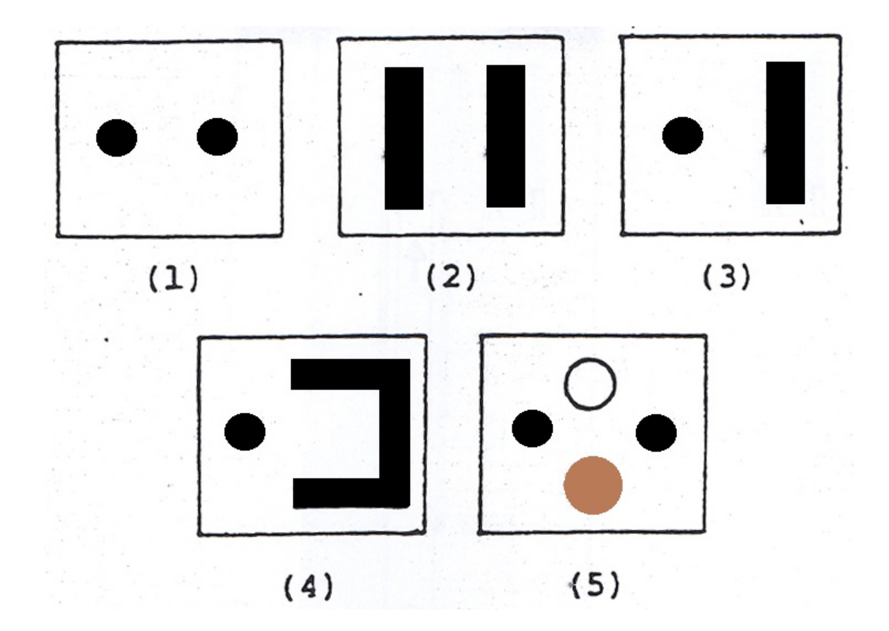
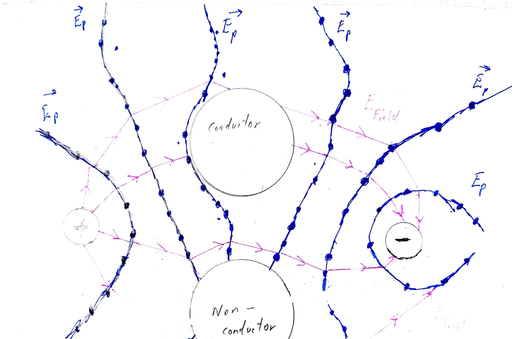

--- 
title: "Electric Field Mapping" 
chapter: "4" 
numbersections: true 
---

# Overview

[Here][1] is the lab manual. The aim of this lab is to give you a visualization for electric fields and electric potential. In the diagram below you can see five diagrams of "resistive boards", which are pieces of apparatus from the in-person lab:

{ width=35% }

The black shapes marked on the boards are electrodes (i.e. conductive surfaces). The procedures in the in-person lab involve connecting up the electrodes to the terminals of a power supply, giving each one a net charge, and thus creating an electric field in the region around the electrodes. Then you would use a probe to measure the voltage (i.e. potential) at various points on the board, to find out where the equipotentials are. And from there you can construct a "representation" of the electric field. Here's an example "mapping pattern" that would be produced in the lab:

{ width=40% }

Obviously, you (remote students) cannot do any of this. So for this lab, your assignment this week will mostly involve using simulations which cover the same stuff. 

# Theory

The topics covered in this lab are electric fields and electric potential. The theory in the lab manual is sparing, so I encourage you to do your own reading. Your class textbook (HRW) is a good place to start. I've posted some more (potential) reading material in the resources folder.  

# Your Task

Run this simulation: [https://phet.colorado.edu/en/simulation/charges-and-fields](https://phet.colorado.edu/en/simulation/charges-and-fields)

Create three different charge patterns with the simulation, and observe the relationship between electric field and electric potential. Explain what you see. 

And answer these questions:

1. Where are the equipotential lines closest together and where are they furthest apart?

2. Do any of your equipotential lines cross? Do you think it's possible for equipotentials to cross?

3. What is the direction of the equipotential lines near the edges of the electrodes?

4. If the polarities of the electrodes are reversed, how do the patterns of electric potential and field change?

5. Can electric field lines cross?

6. What feature of the equipotential map indicates where the electric field is strongest? Explain? 

7. Explain why a surface perpendicular to $\v E$ (electric field) is always an equipotential. 

That's it for this lab. Apart from the theory writeup. Which you should also do. 

[1]: https://physics.nyu.edu/~physlab/GenPhysII_PhysIII/Final_drafts_GPII_Labs/Electric_Field_Mapping_01-27-2017.pdf
